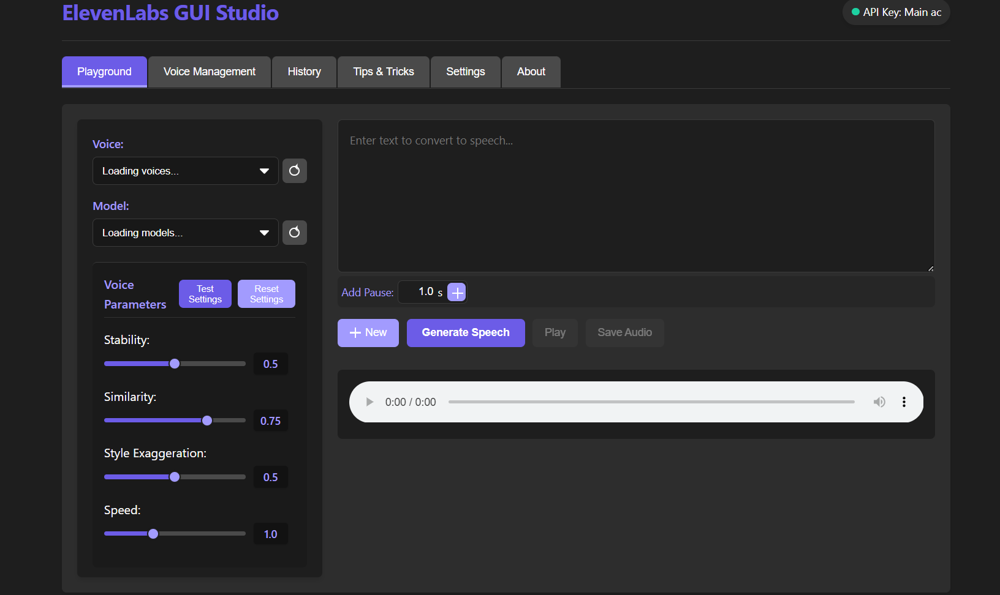

# ElevenLabs GUI Studio

A professional desktop GUI application for interacting with the ElevenLabs API. This application allows you to use ElevenLabs' text-to-speech capabilities directly from your desktop, with a clean and intuitive interface.



## Features

- **Playground**: Convert text to speech using ElevenLabs' advanced AI voices (formerly Text to Speech tab)
- **Voice Management**: View and manage your ElevenLabs voices
- **API Key Management**: Save and manage multiple named API keys securely in a data folder
- **Voice Parameter Controls**: Adjust Speed, Stability, Similarity, and Style Exaggeration with visual sliders
- **Test Settings**: Test your voice settings with a sample text to hear the differences
- **Break Tags**: Easily insert SSML break tags with customizable duration
- **History Tracking**: Keep track of your previous generations with option to delete individual items or clear all history
- **Tips and Tricks**: Best practices for getting the most out of ElevenLabs

## Requirements

- An ElevenLabs API key (get one at [elevenlabs.io](https://elevenlabs.io))
- Node.js and npm installed on your system

## Installation

### Option 1: Download the Release

1. Go to the [Releases](https://github.com/SannidhyaSah/ElevenLabs-GUI-Studio-/releases) page
2. Download the latest version for your operating system
3. Install and run the application

### Option 2: Build from Source

1. Clone this repository:
   ```
   git clone https://github.com/SannidhyaSah/ElevenLabs-GUI-Studio-.git
   ```

2. Navigate to the project directory:
   ```
   cd ElevenLabs-GUI-Studio-
   ```

3. Install dependencies:
   ```
   npm install
   ```

4. Start the application in development mode:
   ```
   npm start
   ```

## Building

To build the application for your platform:

```
npm run build
```

This will create distributable packages in the `dist` directory.

## Usage

### Setting Up API Keys

1. When you first start the application, you'll be directed to the Settings tab to add an API key
2. Enter your ElevenLabs API key in the input field
3. Give your API key a name (e.g., "Personal", "Work", "Testing")
4. Click "Save API Key"
5. You can add multiple API keys and switch between them using the dropdown
6. API keys are stored securely in the data folder

### Generating Speech

1. Navigate to the Playground tab (formerly Text to Speech)
2. Select a voice and model
3. Adjust voice parameters using the sliders
4. Enter the text you want to convert to speech
5. Use the "Add Break" button to insert pause tags if needed
6. Click "Generate Speech" to create the audio
7. Use the player controls to listen to the generated speech
8. Click "Save Audio" to save the audio file to your computer
9. Click the "New" button to start a fresh generation

### Testing Voice Settings

1. Adjust the voice parameters (Stability, Similarity, Style, Speed) using the sliders
2. Click the "Test Settings" button to generate a sample audio with current settings
3. Listen to the audio to hear how your settings affect the voice
4. Click "Reset Settings" to return to default values if needed

### Managing History

1. Navigate to the History tab to view your previous generations
2. Click "Play" on any history item to hear it again
3. Click "Use Text" to load the text from a previous generation
4. Click "Delete" to remove a specific history item
5. Click "Clear History" to remove all history items

## Voice Parameters

- **Stability (0-1)**: Controls how stable/consistent the voice is. Lower values (0.0-0.3) allow for more emotional range and variability, while higher values (0.7-1.0) make the voice more monotonous but consistent.

- **Similarity Boost (0-1)**: Controls how closely the AI adheres to the original voice. Higher values (0.7-1.0) make it sound more like the original speaker, while lower values (0.0-0.3) allow for more creativity but may sound less like the original voice.

- **Style (0-1)**: Controls style exaggeration of the voice. Higher values (0.7-1.0) amplify the style of the original speaker, making the voice more distinctive and characterized. Default is 0.0 (no style exaggeration).

- **Speed (0.5-2.0)**: Controls the speed of the generated speech. Lower values create slower speech (0.5 is half speed), while higher values create faster speech (2.0 is double speed). Default is 1.0 (normal pace).

You can test different combinations of these parameters using the "Test Settings" button to find the perfect voice for your needs.

## Tips for Best Results

- Use proper punctuation to guide the pacing and intonation of the speech
- Use the "Add Break" button to insert pauses of specific duration with `<break time="Xs" />` tags
- Break long texts into smaller paragraphs for better results
- Different voices work better with different models - experiment to find the best combination
- Use the "Test Settings" button to quickly hear how different parameter combinations sound
- For emotional speech, use lower stability values (0.1-0.3)
- For narration or audiobooks, use medium stability (0.4-0.6) and high similarity (0.7-0.9)
- For consistent voice assistants, use high stability (0.7-0.9)

## SSML Support

The application supports SSML (Speech Synthesis Markup Language) tags for more control over the speech:

- `<break time="Xs" />` - Add a pause of X seconds (use the "Add Break" button)
- `<emphasis>text</emphasis>` - Emphasize text
- `<prosody rate="slow/medium/fast">text</prosody>` - Control speech rate
- `<prosody pitch="low/medium/high">text</prosody>` - Control pitch

## Attribution

Created by [@SannidhyaSah](https://github.com/SannidhyaSah)

## Disclaimer

This is an unofficial application and is not affiliated with ElevenLabs. You must have a valid ElevenLabs API key to use this application. All API usage is subject to ElevenLabs' terms of service.

## License

MIT
