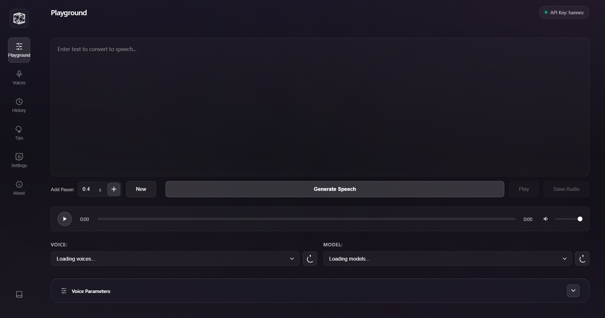

# ElevenLabs GUI Studio v3.0

A modern, user-friendly desktop application for interacting with the ElevenLabs text-to-speech API.




## Features

### Core Features
- **Playground**: Convert text to speech using ElevenLabs' advanced AI voices
- **Voice Cloning** (NEW v2.0): Create custom voice clones by uploading audio samples
- **Voice Management**: Browse, manage, and organize your voice library
- **Voice Library** (NEW v2.0): Access and search through available voices
- **API Key Management**: Save and manage multiple named API keys securely
- **Voice Parameter Controls**: Fine-tune voice output with visual sliders:
  - Speed (0.5-2.0)
  - Stability (0-1)
  - Similarity Boost (0-1)
  - Style Exaggeration (0-1)
- **Preset Management** (NEW v2.0): Save and load custom voice parameter combinations
- **Test Settings**: Preview voice settings with sample text
- **Break Tags**: Insert SSML break tags for natural pauses
- **History Tracking**: Review and replay previous generations
- **Tips and Tricks**: Best practices guide for optimal results

## Requirements

- An ElevenLabs API key (get one at [elevenlabs.io](https://elevenlabs.io))
- Node.js and npm installed on your system

## Installation

### Option 1: Download the Release

1. Go to the [Releases](https://github.com/SannidhyaSah/ElevenLabs-GUI-Studio-/releases) page
2. Download the latest version for your operating system
3. Install and run the application

### Option 2: Build from Source

1. Clone this repository:
   ```
   git clone https://github.com/SannidhyaSah/ElevenLabs-GUI-Studio-.git
   ```

2. Navigate to the project directory:
   ```
   cd ElevenLabs-GUI-Studio-
   ```

3. Install dependencies:
   ```
   npm install
   ```

4. Start the application in development mode:
   ```
   npm start
   ```

## Building

To build the application for your platform:

```
npm run build
```

This will create distributable packages in the `dist` directory.

## Usage

### Setting Up API Keys

1. When you first start the application, you'll be directed to the Settings tab to add an API key
2. Enter your ElevenLabs API key in the input field
3. Give your API key a name (e.g., "Personal", "Work", "Testing")
4. Click "Save API Key"
5. You can add multiple API keys and switch between them using the dropdown
6. API keys are stored securely in the data folder

### Generating Speech

1. Navigate to the Playground tab (formerly Text to Speech)
2. Select a voice and model
3. Adjust voice parameters using the sliders
4. Enter the text you want to convert to speech
5. Use the "Add Break" button to insert pause tags if needed
6. Click "Generate Speech" to create the audio
7. Use the player controls to listen to the generated speech
8. Click "Save Audio" to save the audio file to your computer
9. Click the "New" button to start a fresh generation

### Using Presets (New in v2.0)

1. Select a preset from the dropdown to instantly apply voice settings:
   - **Balanced**: Default settings for general use
   - **Expressive**: Lower stability for emotional range
   - **Stable**: High stability for consistent narration
   - **Fast Speech**: 1.5x speed for quick delivery
   - **Slow & Clear**: 0.8x speed for clarity
2. To save current settings as a preset:
   - Adjust parameters to your liking
   - Enter a name in "Save as..." field
   - Click the save icon
3. To delete a preset:
   - Select it from the dropdown
   - Click the delete icon

### Testing Voice Settings

1. Adjust the voice parameters (Stability, Similarity, Style, Speed) using the sliders
2. Click the "Test Settings" button to generate a sample audio with current settings
3. Listen to the audio to hear how your settings affect the voice
4. Click "Reset Settings" to return to default values if needed

### Voice Cloning (New in v2.0)

1. Navigate to the Voice Management tab
2. Click on "Clone Voice" sub-tab
3. Enter a name for your voice clone
4. Add an optional description
5. Upload audio samples by:
   - Clicking the upload area to browse files
   - Dragging and dropping audio files
6. Add optional labels (e.g., "accent:british, age:middle")
7. Click "Create Voice Clone" to generate your custom voice
8. Your cloned voice will appear in the voice selection dropdown

**Tips for Voice Cloning:**
- Use clear, high-quality audio samples
- Provide multiple samples for better results
- Ensure minimal background noise
- Samples should be between 30 seconds to 3 minutes

### Managing History

1. Navigate to the History tab to view your previous generations
2. Click "Play" on any history item to hear it again
3. Click "Use Text" to load the text from a previous generation
4. Click "Delete" to remove a specific history item
5. Click "Clear History" to remove all history items

## Voice Parameters

- **Stability (0-1)**: Controls how stable/consistent the voice is. Lower values (0.0-0.3) allow for more emotional range and variability, while higher values (0.7-1.0) make the voice more monotonous but consistent.

- **Similarity Boost (0-1)**: Controls how closely the AI adheres to the original voice. Higher values (0.7-1.0) make it sound more like the original speaker, while lower values (0.0-0.3) allow for more creativity but may sound less like the original voice.

- **Style (0-1)**: Controls style exaggeration of the voice. Higher values (0.7-1.0) amplify the style of the original speaker, making the voice more distinctive and characterized. Default is 0.0 (no style exaggeration).

- **Speed (0.5-2.0)**: Controls the speed of the generated speech. Lower values create slower speech (0.5 is half speed), while higher values create faster speech (2.0 is double speed). Default is 1.0 (normal pace).

You can test different combinations of these parameters using the "Test Settings" button to find the perfect voice for your needs.

## Tips for Best Results

- Use proper punctuation to guide the pacing and intonation of the speech
- Use the "Add Break" button to insert pauses of specific duration with `<break time="Xs" />` tags
- Break long texts into smaller paragraphs for better results
- Different voices work better with different models - experiment to find the best combination
- Use the "Test Settings" button to quickly hear how different parameter combinations sound
- For emotional speech, use lower stability values (0.1-0.3)
- For narration or audiobooks, use medium stability (0.4-0.6) and high similarity (0.7-0.9)
- For consistent voice assistants, use high stability (0.7-0.9)

## SSML Support

The application supports SSML (Speech Synthesis Markup Language) tags for more control over the speech:

- `<break time="Xs" />` - Add a pause of X seconds (use the "Add Break" button)
- `<emphasis>text</emphasis>` - Emphasize text
- `<prosody rate="slow/medium/fast">text</prosody>` - Control speech rate
- `<prosody pitch="low/medium/high">text</prosody>` - Control pitch

## Attribution

Created by [@SannidhyaSah](https://github.com/SannidhyaSah)

## Disclaimer

This is an unofficial application and is not affiliated with ElevenLabs. You must have a valid ElevenLabs API key to use this application. All API usage is subject to ElevenLabs' terms of service.

## Changelog

### Version 3.0.0 (2025)
- **Optimized Page Layouts**: Eliminated useless empty space across all pages
  - Reduced padding and margins for better space utilization
  - Improved responsive grid layouts for voice lists and library
  - Better alignment and spacing consistency
  - Optimized form layouts in Voice Management
  - Streamlined Settings and About pages
- **Enhanced UI/UX**: Multiple refinements for better user experience
  - Improved visual hierarchy
  - Better content density without feeling cramped
  - More efficient use of screen real estate

### Version 2.0.0 (2025)
- **Voice Cloning Feature**: Added complete voice cloning functionality
  - Upload multiple audio samples
  - Create custom voice clones
  - Manage voice labels and descriptions
- **Preset Management System**: Save and load voice parameter combinations
  - Default presets included (Balanced, Expressive, Stable, Fast Speech, Slow & Clear)
  - Create custom presets
  - Delete unwanted presets
- **Voice Library Integration**: Browse and search available voices
- **Major UI Overhaul**: Complete redesign with modern dark theme
- **Performance Optimization**: Removed heavy effects for smoother operation
- **Improved Visibility**: Enhanced slider tracks and controls
- **Better Spacing**: Fixed button overlaps and improved layout
- **Color Scheme Update**: Changed from purple to professional gray (#23272e)
- **Notification System**: Reduced duration to 1 second for better UX
- **Preset Management**: Improved preset selector to prevent overflow
- **Responsive Design**: Better adaptation to different screen sizes

### Version 1.0.0 (Initial Release)
- Basic text-to-speech functionality
- Voice and model selection
- Parameter controls
- History tracking
- API key management

## License

MIT
